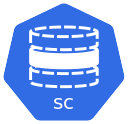

# ice-storageclass

This helm chart creates storageclass kubernetes objects.
You can list any number of storageclasses by adding multiple objects in the values file.

The default values listed are used for items that are required for a PV but not defined in a value file.
Optional items are only added if defined they have no defaults.

Example

```yaml
storageclass:				
  - name: bob				(Default missingname)
    annotations:			(Optional not required)
      foo: bar
    labels:				(Optional not required)
      bar: foo
    provisioner:			(Default kubernetes.io/no-provisioner}
    reclaimPolicy:			(Default Retain}
    volumeBindingMode:			(Default WaitForFirstConsumer)
    parameters:				(Optional not required)
      availability: foo
    allowedTopologies:			(Optional not required)
    - matchLabelExpressions:
      - key: failure-domain.beta.kubernetes.io/zone
        values:
        - us-central-1a
        - us-central-1b
```
